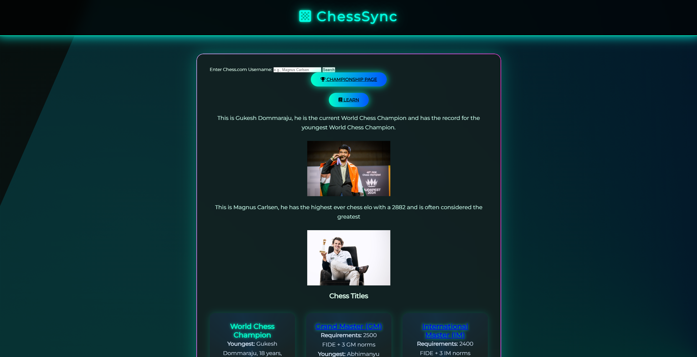
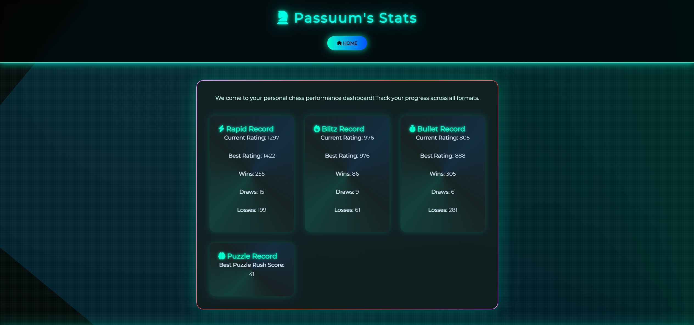
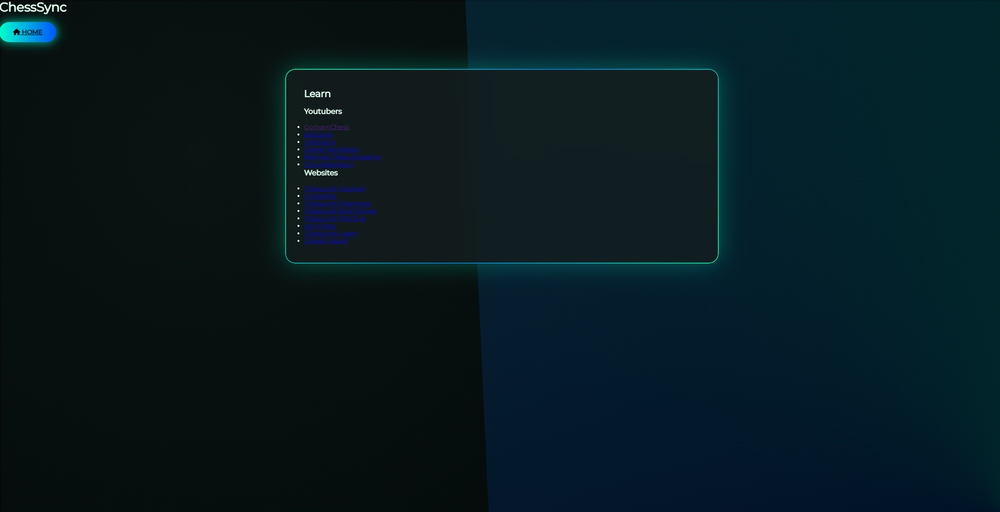

#ChessSync
Chess Sync is a full-stack web analytics platform built with Python (Flask), MySQL, and Bootstrap. It imports, normalizes, and indexes a database of World Chess Championship games from 2000 to 2025, exposing the data through APIs and a responsive dashboard that aggregates and displays player statistics analysis.

## Features
**Historical Championship Data** (MySQL-backed)
- Imports and normalizes World Chess Championship game data (2000–2025)
- Indexed database for efficient querying by player, year, and opening (ECO code)

**Live Player Stats** (Chess.com API-backed)
- Account creation date
- Rapid/Blitz/Bullet ratings (best and current)
- Win/loss/draw record per time control
- Puzzle rating
    
## Screenshots
**Home Page** 

**API Stats Page**

**Learn Page** 

## Tech Stack
- **Backend:** Python, Flask
- **Database:** MySQL
- **Frontend:** Bootstrap, HTML/CSS

## Setup & Installation
### Prerequisites
- Python 3.x
- pip
- **Note:** Requires your own MySQL instance — see [Status](#status) below.

### Steps
1. Clone the repo
2. Install dependencies: `pip install -r requirements.txt`
3. Copy `.env.example` to `.env` and fill in your own MySQL credentials
4. Set up MySQL database using `schema.sql`
5. Run the app: `python ChessSync.py`
6. Visit `http://localhost:5000` in your browser

## Project Structure
ChessSync.py   — main Flask app

db.py          — Flask app config and MySQL connection setup

insert.py      — data import/indexing

modules.py     — shared logic (Chess.com API calls)

queries.py     — SQL query definitions

search.py      — standalone search/query logic

templates/     — HTML views

static/css/    — styling

## Data Source
  Database: [PGNMentor](https://www.pgnmentor.com/files.html#world)

  PubAPI: https://support.chess.com/en/articles/9650547-what-is-the-pubapi-and-how-do-i-use-it

## Database Schema
See [`schema.sql`](./schema.sql) for full table definitions and relationships.

## Status
This project was originally built and tested using a university-provided MySQL instance, which is no longer active. The historical championship database features are not runnable without a live MySQL connection (see Setup). The live player stats lookup (via Chess.com API) does not depend on MySQL and should still function independently.

**Planned:** Migrating the database to AWS (RDS) with the app hosted on EC2 or Elastic Beanstalk, providing a live, publicly accessible version of the full dashboard.
